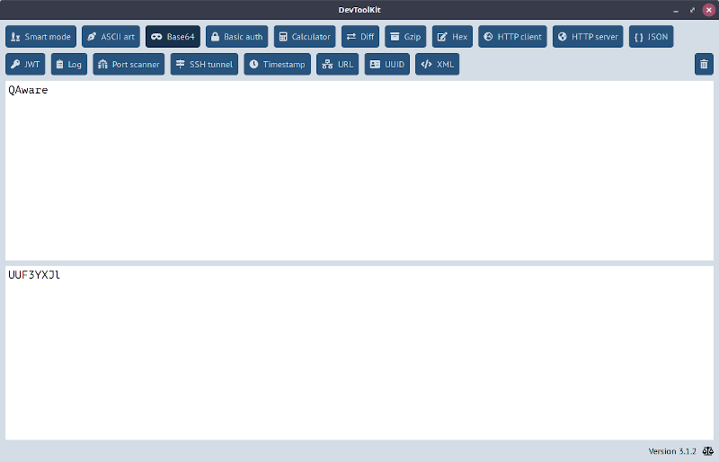

# DevToolKit

[](https://github.com/qaware/dev-tool-kit/actions/workflows/build.yml)


This repository contains a desktop application with many useful tools for software developers.
It is written in Go using [Wails](http://wails.app/) for providing a multi-platform GUI.



## Usage

### Tools

All the tools are organized in tabs. You can click on your button of choice or press `Ctrl+f` to search for a tool.

Among others, the following tools are included:
* Base64 encoding
* Hex editor
* HTTP client
* JSON and XML pretty printing
* JWT decoding
* Port scanner

### Customization

You can add a custom tab to the DevToolKit. Create a new file called `pages.xml` in the same directory as the executable.
Here is an example for a simple HTML page with just a single link:

```XML
<pages>
    <page>
        <name>MyTool</name>
        <title>My cool tool</title>
        <tooltip>This is my cool new tool.</tooltip>
        <icon>fa-tools</icon>
        <body>
            <a href="http://www.qaware.de">QAware</a>
        </body>
    </page>
</pages>
```

Here, `<name>` must be a unique name, `<title>` is the button label, `<tooltip>` is the text for the button tooltip,
 `<icon>` is the [Font Awesome](https://fontawesome.com/v5.14.0/icons?d=gallery&m=free) icon,
and `<body>` is the HTML source of the page.

### Errors

In case of a crash, a stack trace is written to the file `panic.txt` in the same directory as the executable. If you raise a bug report, please attach the content of this file.

## Development

### Install Wails

See https://wails.app/gettingstarted/ to learn how to setup Wails on your platform.

### Build locally

Checkout the code and run `make build-debug` to quickly build a development version with debug logging enabled. The artifact will appear in `build/`.

### Release

Change the version number in the file `main.go` and create a tag consisting of a `v` as prefix and the same version number.
Push the tag to the repository and thus trigger the GitHub actions that will automatically create a new release.
After that, the installed DevToolKits from all the users will update to that new version.